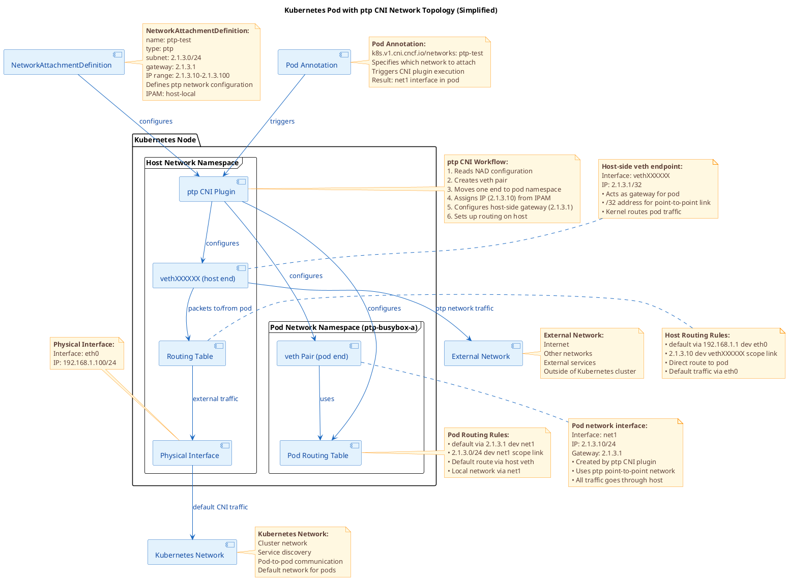
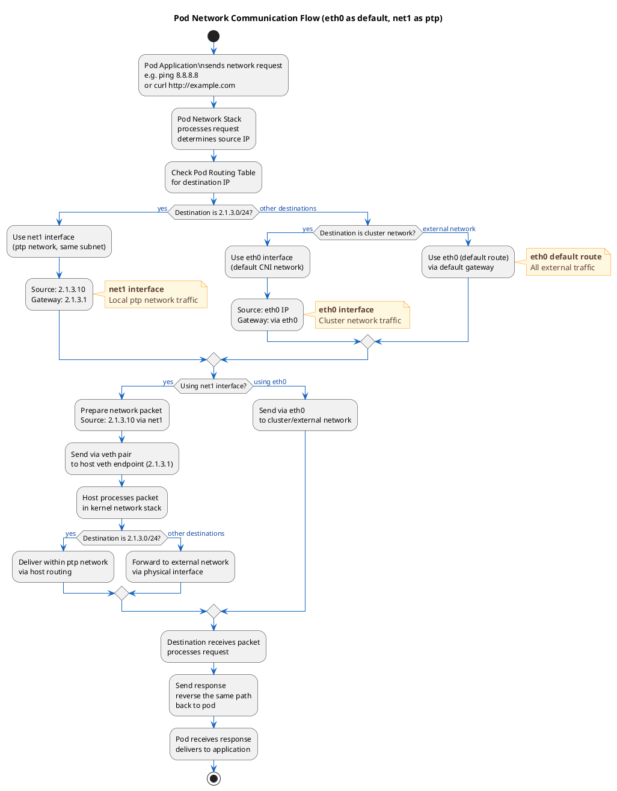

# Macvlan
This project is about the use and configuration of the ptp.

## Reference
1. https://www.cni.dev/plugins/current/main/ptp/

## Flowsheet

## Limitations on use
1. Avoid using PTP for Pod to Pod communication, PTP is designed for point-to-point connections and is not suitable for multi Pod shared networks.
2. Each vet pair is completely independent and does not share a broadcast domain.
3. After the packet sent from Pod through net1 reaches the host, the host will not perform source address translation (SNAT) for packets from 2.1.3.0/24 by default. The external network is unable to route the reply back to this private address.
